# Learned Focused Plenoptic Image Compression with Microimage Preprocessing and Global Attention
Pytorch implementation of the paper "Learned Focused Plenoptic Image Compression with Microimage 
Preprocessing and Global Attention". IEEE Transactions on Multimedia 2023.
This repository is based on [CompressAI](https://github.com/InterDigitalInc/CompressAI). 
We kept scripts for training and evaluation, and removed other components. 
 For the official code release, see the [CompressAI](https://github.com/InterDigitalInc/CompressAI).
## Related links
 * CompressAI: https://github.com/InterDigitalInc/CompressAI
 * GACN-QVRF (variable rate model of GACN) : https://github.com/VincentChandelier/GACN-QVRF
## Table of Contents
- [AvailableData](#AvailableData)
- [Dataset](#Dataset)
- [Rendering](Rendering)
- [Global Attention Compression Network (GACN)](#Global Attention Compression Network (GACN))
## About
This repo defines the focused plenoptic image dataset “FPI2k" and the global-attention-based models for learned focused plenoptic image compression in "Learned Focused Plenoptic Image Compression with Microimage 
Preprocessing and Global Attention".

# AvailableData
 Data |  Link                                                                                              |
| ----|---------------------------------------------------------------------------------------------------|
| FPI2k original images | [FPI2k original images](https://pan.baidu.com/s/1CQ9hKhxY1z-sIHsqr00XXg?pwd=xya8)    |
| Packaged FPI2k original images | [Packaged FPI2k original images](https://pan.baidu.com/s/1UCCqHB0tfEKILJp0cHaucg?pwd=hy0j)    |
| FPI2k preprocessed images| [FPI2k preprocessed images](https://pan.baidu.com/s/1omfnFkK_XQpBrJyE6epkXQ?pwd=2hw0)     |
| Packaged FPI2k preprocessed images| [Packaged FPI2k preprocessed images](https://pan.baidu.com/s/1DkCbAQHN4UP3Cajug3uMjg?pwd=t98i)     |
| TSPC white image | [TSPC white image](https://drive.google.com/file/d/1jaC2OsIWTVjTBicbBOrEr8-T1o4ZuTh0/view?usp=sharing) |
| Training patches | [Training patches](https://pan.baidu.com/s/1hKjg0eXT_bkJfQn8z0z3VA?pwd=p4zm)    |
| ffmpeg | [ffmpeg](https://drive.google.com/file/d/15mvTI74xi4dB3cov7oHByEdARQLAC_XV/view?usp=sharing) |
| Packaged training patches | [Packaged training patches](https://pan.baidu.com/s/1MSn2dEriB1Wal2uOMQe6hg?pwd=daei)    |
| Full-resolution test images | [Full-resolution test images](https://pan.baidu.com/s/1LSFfkxHW1inb04PVt3DwIA?pwd=5lvb) |
| Model checkpoints   | [Model checkpoints](https://pan.baidu.com/s/1hsFpQic6bMRZFvcmbAN7-g?pwd=54rv)|

# Dataset
“FPI2k” is  a focused plenoptic image dataset with 1910 images captured from real 
scenes indoor and outdoor with object depth variations.
From a single plenoptic image, 5×5 sub-aperture images can be 
generated with much larger disparities one from the others.
1910 focused plenoptic images are captured and manually annotated 
to 32 categories based on their contents

The original focused plenoptic images are available to download.(https://pan.baidu.com/s/1CQ9hKhxY1z-sIHsqr00XXg?pwd=xya8, 
access code:xya8)


## Data preprocessing
Based on the observations that inter-microimage pixels, 
boundary incomplete microimages, and vignetting pixels in the 
microimages are ineffective in light field applications, like 
refocusing, multi-view rendering, etc., a sub-aperture images
the lossless preprocessing scheme is proposed to reshape the 
sub-aperture effective pixels in each microimage and align the 
cropped microimages to the rectangular grid to be compatible 
with patch-based training and to reduce pixel redundancy.


The preprocessed focused plenoptic images are available to download.(https://pan.baidu.com/s/1omfnFkK_XQpBrJyE6epkXQ?pwd=2hw0)

# Rendering
The directory Rendering provided the rendering code to render sub-aperture images from
 original or preprocessed focused plenoptic images
 
Download the [TSPC white image coefficients](https://drive.google.com/file/d/1jaC2OsIWTVjTBicbBOrEr8-T1o4ZuTh0/view?usp=sharing)
in *./Rendering/FocusedPlenopticRendering* for devigneting.

Run the *./Rendering/Original2SAI.m* to render the sub-aperture images from original focused plenoptic images.

Run the *./Rendering/Original2Preprocessed.m* to preprocess the original focused plenoptic images to preprocess 
focused plenoptic images.

Run the *./Rendering/Preprocessed2SAI.m* to render the sub-aperture images from preprocessed focused plenoptic images.

# Global Attention Compression Network (GACN)
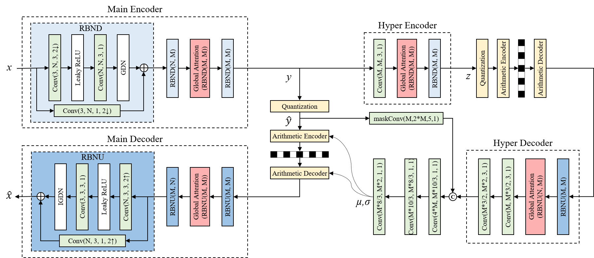
## Installation

Install [CompressAI](https://github.com/InterDigitalInc/CompressAI) and the packages required for development.
```bash
conda create -n FPIcompress python=3.9
conda activate FPIcompress
pip install compressai==1.1.5
pip install ptflops
pip install einops
pip install tensorboardX
```

> **Note**: wheels are available for Linux and MacOS.

## Usage

### Traing dataset 
The 75080 patches of preprocessed plenoptic images are available.
The [full-resolution test images](https://pan.baidu.com/s/1LSFfkxHW1inb04PVt3DwIA?pwd=5lvb) are available.

### Available model
- `Proposed`: GACN

- `ProposedBasemodel`: GACN w/o GA

- `Factor`:  End-to-end optimized image compression

- `Hyper`: Variational image compression with a scale hyperprior

- `Joint`: Joint autoregressive and hierarchical priors for learned image compression

- `Cheng2020Attention`: Learned image compression with discretized gaussian mixture likelihoods and attention modules

- `HyperGlobalModule`: Hyper+GA

- `FactorGlobalModule`: Factor+GA
### Training
An exemplary  training script with a rate-distortion loss is provided in
`train.py`. 

Training a model:
```bash
python train.py -d ./dataset --model Proposed -e 50  -lr 1e-4 -n 8  --lambda 1e-1 --batch-size 4  --test-batch-size 4 --aux-learning-rate 1e-4 --patch-size 384 384 --cuda --save --seed 1926 --clip_max_norm 1.0 --gpu-id 1 --savepath  ./checkpoint/PLConvTrans01
```

### Evaluation

To evaluate a trained model, the evaluation script is:
```bash
python Inference.py --dataset /path/to/image/folder/ --output_path /path/to/reconstruction/folder/ -m Proposed -p ./updatedCheckpoint/PLConvTrans01.pth.tar --patch 384
```
More details can refer to Inference.sh

Run the *./Rendering/SubapertureImageDistortion.m* to rendering the sub-aperture images from reconstructed focused plenoptic images and calculate the distortion.


### Pretrained Models
Pretrained models (optimized for MSE) trained from focused plenoptic image patches are available.

| Method | Lambda | Link                                                                                              |
| ---- |--------|---------------------------------------------------------------------------------------------------|
| Proposed | 0.1 | [GACN_0.1](https://drive.google.com/file/d/1pVP3zWVkSJo00aT8bob72kr6Zd3Bg58p/view?usp=sharing)    |
| Proposed | 0.05  | [GACN_0.05](https://drive.google.com/file/d/1fvko3FyRBLLOumXCALxz7QJRnTew4zSc/view?usp=sharing)     |
| Proposed | 0.025 | [GACN_0.025](https://drive.google.com/file/d/1FRdLcFrqdBqfZXRhKhp2BCIkj36nabvh/view?usp=sharing) |
| Proposed | 0.01 | [GACN_0.01](https://drive.google.com/file/d/10p0mM39xzAGm1VpUNmdyRp6kCvNS5GoW/view?usp=sharing)    |
| Proposed | 0.005 | [GACN_0.005](https://drive.google.com/file/d/1FvGB882FdJ8rCEYkq0Wixa24ypuQiYLz/view?usp=sharing) |
| Proposed | 0.013  | [GACN_0.001](https://drive.google.com/file/d/1UNU6rzXuIsMkDz75WDLzrg8ViOw-8Gc8/view?usp=sharing)  |

All the checkpoints are available at：https://pan.baidu.com/s/1hsFpQic6bMRZFvcmbAN7-g?pwd=54rv, access code：54rv


## Results

### Note 
The distortion and bpp are defined to ensure comparison fairness of different compression input formats for original-plenoptic-image compression, preprocessed-plenoptic-image compression, and sub-aperture-image compression.

The distortion between the reference sub-aperture images and the reconstructed sub-aperture images is measured by the average of PSNR or MS-SSIM of each sub-aperture image.

The bitrate is defined by bit-per-pixel (bpp) which is calculated via dividing the number of consumed bits by the total number of pixels of the original plenoptic image which is 4080x3068. 

### Visualization

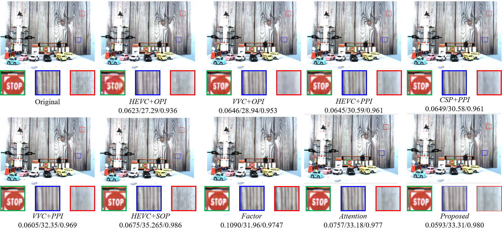
>  Visualization of the reconstructed central sub-aperture image of "Car".

### RD curves
 Visualization of the reconstructed image Car.
 RD curves on I01 "Cars"
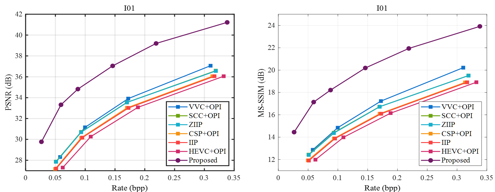
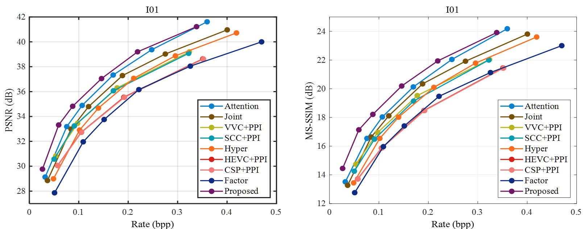
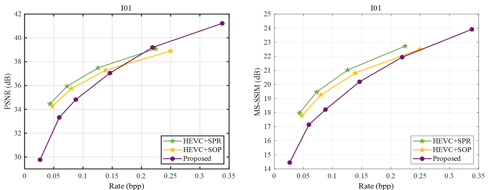

RD curves on I15 "Matryoshka_170"
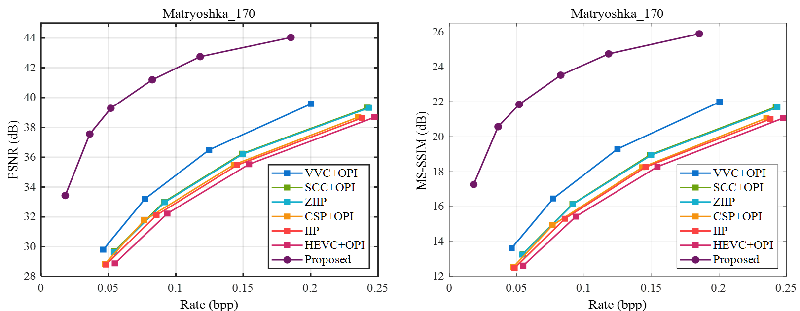
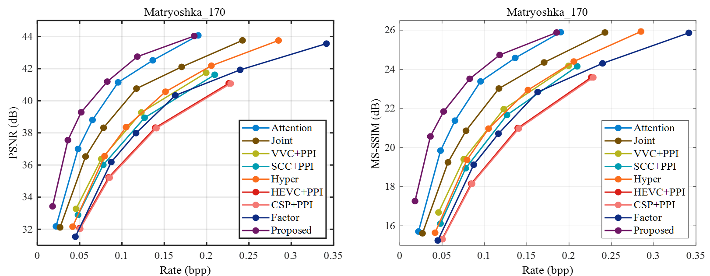
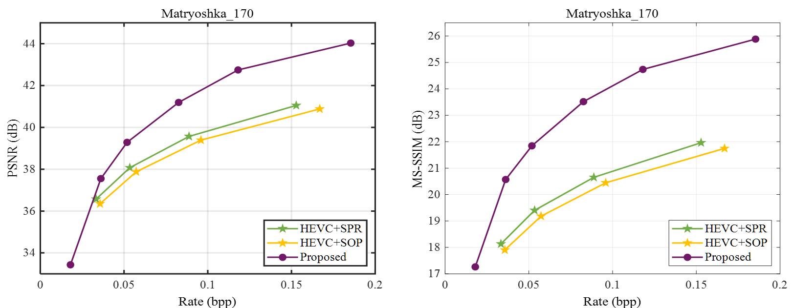

RD curves on 20 test Images
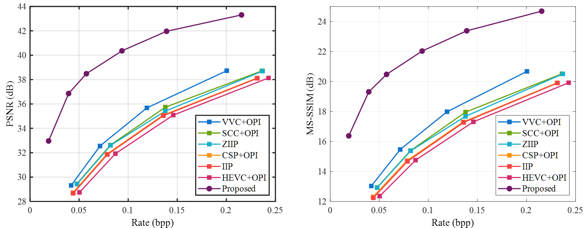
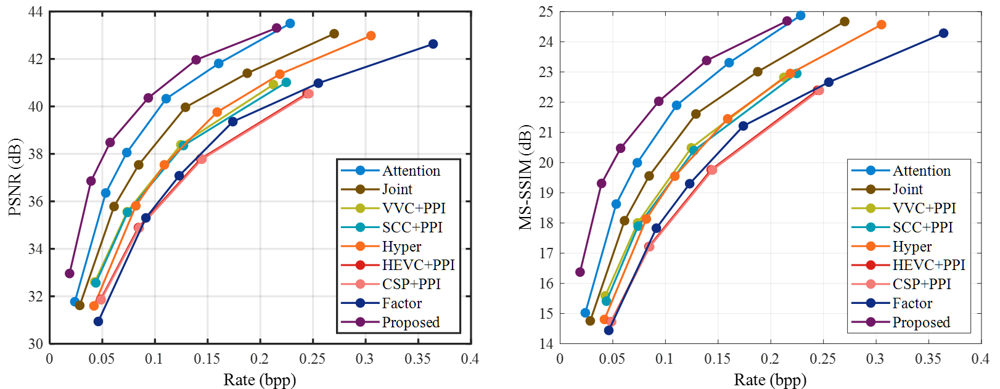
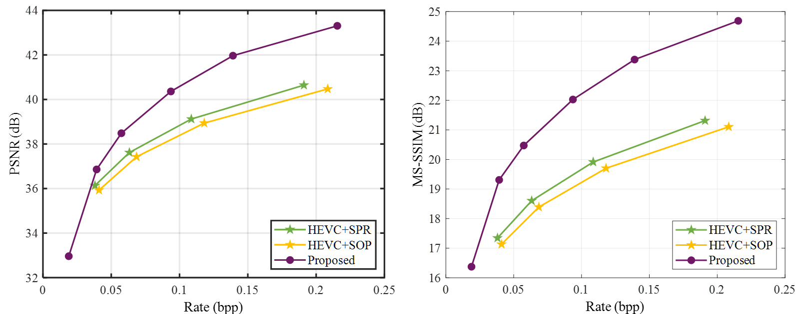


## Citation
If you have any problem, please contact me: tkd20@mails.tsinghua.edu.cn

If you think it is useful for your reseach, please cite our TMM2023 paper.
```
@ARTICLE{10120973,
  author={Tong, Kedeng and Jin, Xin and Yang, Yuqing and Wang, Chen and Kang, Jinshi and Jiang, Fan},
  journal={IEEE Transactions on Multimedia}, 
  title={Learned Focused Plenoptic Image Compression with Microimage Preprocessing and Global Attention}, 
  year={2023},
  volume={},
  number={},
  pages={1-14},
  doi={10.1109/TMM.2023.3272747}}
```


